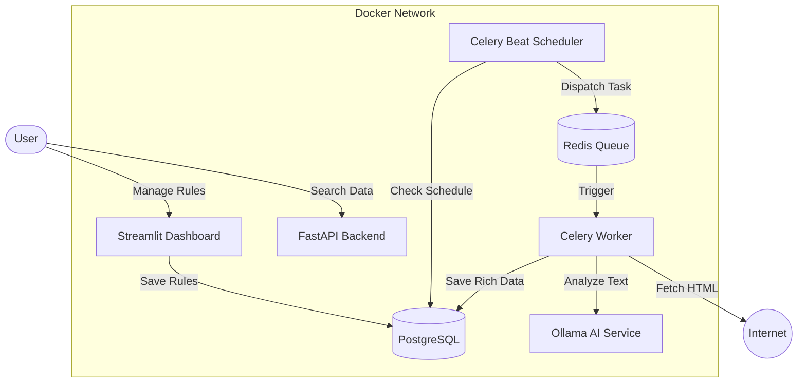

# 🕷️ AI-Powered Enterprise Web Scraper

> A self-optimizing, containerized intelligence pipeline that scrapes, analyzes, and categorizes web content using a local Large Language Model (LLM).

[](https://github.com/abtn/scrapping-project-for-abtin/actions/workflows/ci.yml)


## 🧠 What Makes This Special?

Unlike traditional scrapers that blindly download text, this system is an **Active Agent**:

1. **AI Enrichment:** Every article is sent to a local "Brain" (Ollama running Phi-3.5 or Llama 3) to generate a **3-sentence summary**, **tags**, **category**, and an **urgency score (1-10)**.
2. **Adaptive Scheduling:** The system "learns" from the content.
    * *High Urgency (Breaking News):* Re-scrapes every 5 minutes.
    * *Low Urgency (Evergreen):* Backs off to once every 24 hours.
3. **Microservices Architecture:** Fully decoupled services (Ingest, Worker, Storage, API, AI) running via Docker Compose.

## 🏗️ Architecture



## 🚀 Quick Start

### Prerequisites
* **Docker & Docker Compose**
* (Optional) NVIDIA GPU for faster AI inference (works on CPU too).

### 1. Clone & Configure
```bash
git clone https://github.com/abtn/scrapping-project-for-abtin.git
cd scrapping-project-for-abtin

# Create the environment file
touch .env
```

Add the following to your `.env`:
```ini
POSTGRES_USER=admin
POSTGRES_PASSWORD=adminpass
POSTGRES_DB=scraper_db
POSTGRES_HOST=postgres
REDIS_URL=redis://redis:6379/0

# AI Configuration
AI_BASE_URL=http://ollama:11434
AI_MODEL=phi3.5
```

### 2. Launch the Stack
This will build the containers and download the AI model (approx. 2.2GB) on the first run.
```bash
docker compose up --build -d
```

### 3. Initialize Database
Apply the schema and migrations.
```bash
docker exec scraper_api alembic upgrade head
```

---

## 🖥️ User Interfaces

### 1. Management Dashboard (Ingestion)
**URL:** `http://localhost:8501`
* **Bulk Add:** Paste a list of URLs to scrape immediately.
* **Scheduler:** Create, edit, and delete recurring scraping jobs.
* **Analytics:** View data quality stats.

### 2. API & Documentation (Consumption)
**URL:** `http://localhost:8000/docs`
* **GET /api/v1/articles**: Search articles with filtering (`?q=keyword`).
* **GET /api/v1/articles/{id}**: Retrieve full clean text and AI metadata.

---

## 🛠️ Development & Commands

### Running Tests
The project includes a full test suite (mocking the Database, Network, and AI).
```bash
# Install local dev deps
pip install -r requirements.txt

# Run pytest
pytest tests/ -v
```

### Database Migrations
If you modify `src/database/models.py`, generate a new migration:
```bash
docker exec scraper_api alembic revision --autogenerate -m "description_of_change"
docker exec scraper_api alembic upgrade head
```

### Changing the AI Model
To switch to a different model (e.g., `llama3.2` or `mistral`), simply update your `.env` file and restart:
```ini
AI_MODEL=llama3.2
```
```bash
docker compose up -d
```
*(Note: The system will automatically pull the new model on startup.)*

## 📦 Tech Stack

* **Language:** Python 3.10
* **Queue:** Celery + Redis
* **Concurrency:** Gevent (High-performance I/O)
* **Database:** PostgreSQL + SQLAlchemy + Alembic
* **AI/ML:** Ollama (Local Inference)
* **Web Frameworks:** FastAPI (Backend), Streamlit (Frontend)
* **Parsing:** Trafilatura + BeautifulSoup4