# 🕷️ Nexus — Hybrid AI Intelligence Pipeline

A containerized, self-optimizing web intelligence pipeline that ingests content at scale and enriches it with a Hybrid AI strategy (cloud speed + local privacy). Designed for high-throughput scraping, resilient enrichment, and easy observability.

[](https://github.com/abtn/scrapping-project-for-abtin/actions/workflows/ci.yml)


---

## Overview

Nexus uses a "Dual‑Brain" Fast/Slow architecture to process thousands of URLs without creating bottlenecks:

- ⚡ Fast Ingestion (The Body): highly concurrent workers fetch HTML, respect `robots.txt`, extract and persist raw content (≈ 1s/article).
- 🧠 Smart Enrichment (The Brain): secondary workers perform semantic enrichment through a Hybrid AI pipeline:
  - Primary (speed): OpenRouter (Mistral/Llama) for fast summaries, tagging, and urgency scoring (≈ 2s/article).
  - Fallback (resilience): local Ollama instance if the cloud API is unavailable or API keys fail.

This decoupled model ensures ingestion continues even when enrichment is delayed or offline.

---

## Architecture

```mermaid
graph TD
    User([User])
    subgraph "Docker Network"
        Dash[Streamlit Dashboard]
        API[FastAPI Backend]
        DB[(PostgreSQL)]
        Redis[(Redis Queue)]
        
        subgraph "Scaling Workers"
            Scraper[⚡ Scraper Worker]
            Enricher[🧠 AI Worker]
        end
        
        BrainLocal[Ollama Service]
        BrainCloud[OpenRouter API]
    end

    User -->|Manage Rules| Dash
    Dash -->|Save Jobs| DB
    Dash -->|Trigger| Redis
    
    Redis -->|Queue: Default| Scraper
    Scraper -->|Fetch & Parse| Internet((Internet))
    Scraper -->|Save Raw| DB
    Scraper -->|Chain Task| Redis
    
    Redis -->|Queue: AI| Enricher
    Enricher -->|1. Try API| BrainCloud
    Enricher -->|2. Fallback| BrainLocal
    Enricher -->|Save Metadata| DB
```



---

## Features

- High-concurrency scraping (gevent-backed) with politeness (robots.txt).
- Celery + Redis task queues with distinct pools for IO (gevent) and CPU/API-bound work (prefork).
- Hybrid AI enrichment: primary cloud model with automatic local fallback.
- Streamlit dashboard for live pipeline monitoring and job scheduling.
- Postgres-backed persistence and straightforward migrations via Alembic.
- Container-first: Docker Compose for local dev and deployment.

---

## Quick Start

### Prerequisites
- Docker & Docker Compose
- OpenRouter API key (sign up at [openrouter.ai](https://openrouter.ai))

### Clone
```bash
git clone https://github.com/abtn/scrapping-project-for-abtin.git
cd scrapping-project-for-abtin
touch .env
```

### Configure (.env)
Populate `.env` with the following (adjust secrets and models as needed):

```ini
# Database (PostgreSQL)
POSTGRES_USER=admin
POSTGRES_PASSWORD=adminpass
POSTGRES_DB=scraper_db
POSTGRES_HOST=postgres
POSTGRES_PORT=5432
REDIS_URL=redis://redis:6379/0

# --- AI CONFIGURATION ---

# 1. Primary: OpenRouter (Cloud)
OPENROUTER_API_KEY=sk-or-v1-YOUR_KEY_HERE
OPENROUTER_MODEL=mistralai/mistral-small-3.1-24b-instruct:free

# 2. Fallback: Ollama (Local)
AI_BASE_URL=http://ollama:11434
AI_MODEL=phi3.5
```

### Launch
Build and start all services:
```bash
docker compose up --build -d
```

### Initialize DB
Run database migrations:
```bash
docker exec scraper_api alembic upgrade head
```

---

## Interfaces

### Intelligence Dashboard
- URL: http://localhost:8501
- Live pipeline status (Pending → Processing → Completed)
- Visual feed of AI summaries, urgency scores, and tags
- Job scheduler and re-queue (rescue) operations

### JSON API (OpenAPI)
- URL: http://localhost:8000/docs
- Example: `GET /api/v1/articles` — search and retrieve enriched articles

---

## Development

### Worker Pools & Responsibilities
- Scraper Worker: gevent pool (50+ concurrency) — optimized for network I/O and fast ingestion.
- AI Worker: prefork pool — optimized for CPU and external API latency.
- Tasks are chained (Celery `chain()`) so enrichment runs only after ingestion completes.

### Run Tests
```bash
docker exec scraper_api pytest tests/ -v
```

### Reset Data
Clear tables while preserving configuration:
```bash
docker exec -i scraper_postgres psql -U admin -d scraper_db -c "TRUNCATE TABLE scraped_data, logs, sources RESTART IDENTITY CASCADE;"
```

---

## Operational notes

- Configure the OpenRouter model and Ollama model to match available capacity and privacy requirements.
- Monitor Redis and Postgres metrics; tune Celery concurrency to match resource limits.
- Keep the Ollama container accessible on the internal Docker network if using local fallbacks.

---

## Contributing

Contributions, bug reports, and feature requests are welcome. Please open an issue or submit a PR with a clear description and tests when applicable.

---

## License

Specify your license here (e.g., MIT). Update the repository with a LICENSE file.